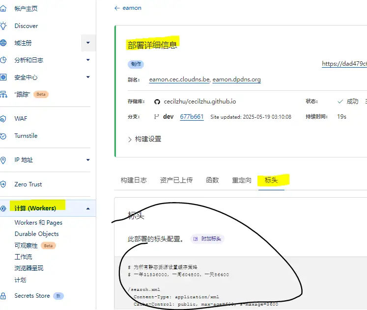
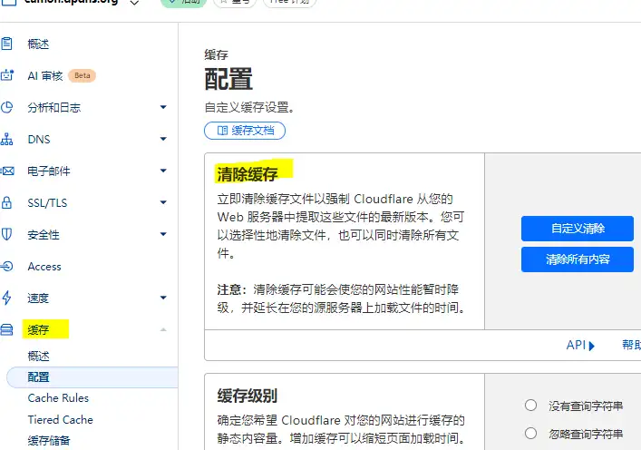

[TOC]

## 一、直接访问`*.pages.dev`默认域名
1. 在`source/`目录下新建`_headers`配置文件（无拓展名），内容（注意缩进）如下，

```
# 为所有静态资源设置缓存策略
# 一年31536000，一周604800，一天86400

/search.xml
  Content-Type: application/xml
  Cache-Control: public, max-age=600, s-maxage=3600
  
/
  Cache-Control: public, max-age=600, s-maxage=3600
  
/posts/*
  Cache-Control: public, max-age=600, s-maxage=3600

/*.css
  Content-Type: text/css; charset=utf-8
  Cache-Control: public, max-age=86400, s-maxage=31536000

/*.js
  Content-Type: application/javascript
  Cache-Control: public, max-age=604800, s-maxage=31536000

/json/*
  Content-Type: application/json
  Cache-Control: public, max-age=604800, s-maxage=31536000

/icons/*
  Content-Type: image/webp
  Cache-Control: public, max-age=604800, s-maxage=31536000
```
（Cache-Control 的 max-age 是客户端缓存时间；s-maxage 是CDN 边缘节点（Cloudflare Edge）缓存时间；单位为“秒”。）

2. 部署pages项目时,会自动应用 `_headers`配置文件中定义的缓存规则！


## 二、访问由CF管理的域名
若CFPages项目绑定了自定义域名，比如`aa.com`，且在该域名对应的CF面板中配置了“缓存规则”，项目内 _headers 文件中又同步设置了 Cache-Control。此时访问`aa.com`时，，针对`同一资源路径`，前者会覆盖后者。
优先级如下，
<strong>
</strong>

## 三、如何清除`边缘缓存`
### *.pages.dev默认域名
`*.pages.dev`默认域名是 Cloudflare 拥有的共享域名，不在用户的 DNS 控制之下，用户没有清除缓存的权限，无法通过 Cloudflare 控制台或 API 强制清除边缘缓存，只有如下两种方法：


1. 等待`s-maxage`自动过期;
2. 重新部署项目（版本变更，会强制刷新`边缘缓存`）

### CF管理的域名
由于该自定义域名在用户的 DNS 控制之下，除了以上两种方式，还可以直接通过` Cloudflare 控制台`或 `API `强制清除`边缘缓存`。
1. 登录` Cloudflare 控制台`，点击对应区域的`清除边缘缓存`按钮，如下图。

2. 调用CF的 `清理边缘缓存API`。
```js
const axios = require('axios');
// 配置
const CLOUDFLARE_API_TOKEN = 'xxxxxxxxxxxxxxxxxxxxxxxxxxxxxxxx';
const CLOUDFLARE_ZONE_ID = 'xxxxxxxxxxxxxxxxxxxxxxxxxxxxxxxx';
const CLOUDFLARE_CACHE_API = `https://api.cloudflare.com/client/v4/zones/${CLOUDFLARE_ZONE_ID}/purge_cache`;

// 清理缓存
async function clearCache() {
  try {
    const response = await axios.post(
      CLOUDFLARE_CACHE_API,
      { purge_everything: true },
      {
        headers: {
          Authorization: `Bearer ${CLOUDFLARE_API_TOKEN}`,
          'Content-Type': 'application/json',
        },
      }
    );

    if (response.data.success) {
      console.log('Cloudflare 缓存(eamon.dpdns.org区域)已清理成功！');
    } else {
      console.error('缓存清理失败：', response.data.errors);
    }
  } catch (error) {
    console.error('清理缓存失败：', error.message);
  }
}
```

