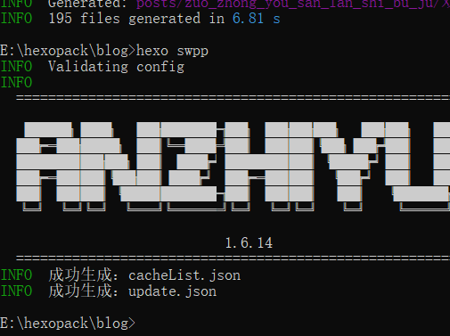

[TOC]

## 一、 网站（主要）目录结构：

 "tree /f > tree.txt"命令，将当前目录下的 所有文件夹及文件 以“文件树”形式输出到当前路径下的tree.txt中。

 blog/source文件夹下：

```txt
│  ads.txt
│  cacheList.json
│  manifest.json
│  README.md
│  update.json
│  
├─about
│      index.md
│      
├─archives
│      index.md
│      
├─categories
│      index.md
│      
├─icons
│      icon-192x192.png
│      
├─tags
│      index.md
│      
├─_data
│      about.yml
│      link.yml
│      
├─_drafts
└─_posts
    │  absolute探讨.md
```

blog/public文件夹下：

  ```
  │  ads.txt
  │  cacheList.json
  │  manifest.json
  │  README.md
  │  update.json
  │  (上面从是source经`hexo g`来的)
  │
  │  404.html
  │  index.html
  │  search.xml
  │  sitemap.txt
  │  sw-dom.js
  │  sw.js
  │  
  ├─about
  │      index.html
  │      
  ├─archives
  │  │  index.html
  │  │                                 
  ├─categories
  │  │  index.html
  │  │  
  │  ├─learning
  │  │  │  index.html    
  ├─css
  │      index.css    
  ├─icons
  │      icon-192x192.png
  ├─img
  │      10.png    
  ├─js
  │  │  main.js            
  ├─page
  │  ├─2
  │  │      index.html       
  ├─posts
  │  │  absolute_tan_tao.html
  ```

## 二、`hexo-swpp@3.3.1`和`swpp-backends@2.3.11`

1. 注意两者的版本要相兼容，且不能太高；
2. "hexo-swpp@4.0.0-alpha.112"和"swpp-backends@3.0.0-alpha.422"虽相兼容,但会跳过“主题中的sw-rule.js”，须另外配置seviceWorker服务。


```
# pwa资源优化
swpp:
  # 是否启用插件
  enable: true
  # 是否在发布前自动执行脚本
  auto_exec: false
  npm_url: 'https://registry.npmmirror.com'
```

## 三、`update.json`和`cacheList.json`
1. 这两个文件是`hexo swpp`命令同时生成的（前提是`_config.yml`中的swpp选项`auto_exec:false`！否则`hexo swpp`命令无效，只能经`hexo d`命令才可生成！）。
   
2. 只有 存在于`cacheList.json`文件列表中的资源，才能被seviceWorker缓存；该文件列表的变动会随即影响`update.json`中的内容（记录更新了哪些文件，更新seviceWorker的版本号）。
3. 服务器根目录必须有`update.json`，用于“记录sw中的文件更新并更改sw缓存版本号”；若网站根目录（包括服务器根目录）缺失该文件，执行`hexo swpp`会报错；故直接放到source目录，首次新建`update.json`并推送到服务器，今后`hexo swpp`会自动以服务器上的update.json为基础“记录sw中的文件更新并更改sw缓存版本号”，并同步到本地public中的`update.json`。
4. `cacheList.json`的生成出口是`public/`；执行`hexo g`后该目录会被删除；所以当不执行`hexo swpp`，或`auto_exec:false`条件下也不执行`hexo d`时，为保证服务器根目录一直存在`cacheList.json`，须直接拷贝一份到`source/`下。
 
 1. 今后即便直接`hexo g`不再执行`hexo swpp`也有 旧`cacheList.json`可推送到服务器;
 2. 若`hexo g`后，继续执行`hexo swpp`会生成`cacheList.json`覆盖旧的；同时public中的`update.json`会以服务器上的`update.json`为基准，记录变动的内容，本地public中的`update.json`自动与服务器同步。

