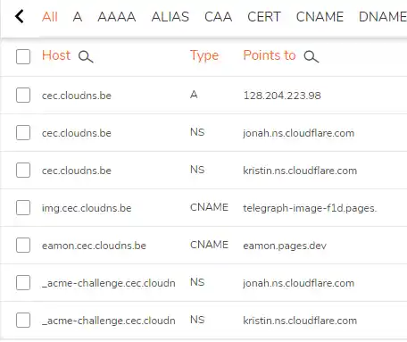
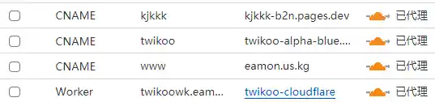

[TOC]

## 更新cloudns的`NS记录`和`TXT记录`

1. 得到cloudns域名后，删除cloudns上的旧记录，CF新建站点（该cloudns域名）；
2. 首先，将CF提供的“2个NS名称服务器”均添加到cloudns【注意`NS`记录】；
3. 其次，将CF为该域名提供的“2个txt证书（通用、高级）”均添加到cloudns：有以下`两种`方式：

   1. 将证书添加为 两个`NS`记录：“相同的证书名称”分别指向CF不同的“NS名称服务器”；

      

   2. 共添加 四个`txt`记录：由于每个txt证书name均对应两个证书value，故共有四个证书value。“相同的证书名称”分别指向四个不同的证书value，此四条txt记录添加完毕。

## CF上的cloudns域名`双向解析`
1. 不同于其它域名托管，即便已经成功将cloudns域名服务器更换成了CF提供的“NS名称服务器”，之后该域名添加任何新纪录（如A、CNAME等），也必须添加到原来的cloudns域名记录列表中才能生效！<strong></strong>
2. 之所以将该cloudns域名交由CF共同管理，是为了能使用cloudflare提供的，如cdn，缓存管理等额外服务。<strong></strong>

## CF的worker或pages项目绑定cloudns域名
1. CF的worker项目添加自定义域名，会自动在CF域名管理处添加`worker记录`，但在cloudns域名管理处要添加`CNAME记录`；CF pages项目一直是`CNAME记录`。

   

2. <strong></strong>
    
    须先要在项目设置处点击添加自定义域名按钮，才会开始DNS解析。若未经项目允许直接添加CNAME记录指向该项目，无效！
    
    
    同理，若未经虚拟主机主动添加第三方域名，即便第三方域名直接通过（如A、CNAME等）指向主机项目地址，也难以重定向到该主机项目！
    

