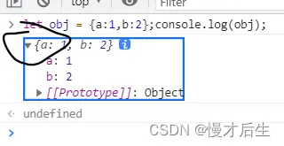

1.Log (anObject)的输出具有误导性; 只有在控制台中展开 > 时才能解析显示的对象的状态。它不是您在 console.log 对象时对象的状态。
相反，尝试 console.log (Object.keys ()) ，或者甚至console.log(JSON.parse(JSON.stringify(obj))) ，您将看到键，或者调用 console.log 时对象的状态。
2.来自 MDN：“不要使用console.log(obj)，使用console.log(JSON.parse(JSON.stringify(obj)))。这样你就可以确定你obj在记录它的那一刻看到了它的价值。否则，许多浏览器提供了一个实时视图，随着值的变化而不断更新。这可能不是你想要的想。” [developer.mozilla.org/en-US/docs/Web/API/Console/log](https://developer.mozilla.org/en-US/docs/Web/API/Console/log) – 拉菲

## 详见：
[console.log - Web API 接口参考 | MDN](https://developer.mozilla.org/zh-CN/docs/Web/API/Console/log)
[javascript - Can't access object property, even though it shows up in a console log - Stack Overflow](https://stackoverflow.com/questions/17546953/cant-access-object-property-even-though-it-shows-up-in-a-console-log/39606500)

## 我的理解（可能有误，仅当参考）：

1.如下图，只有在控制台点击“箭头”后，里面看到的 才是 对象当前状态的 真实值。若只能console.log()输出，而无法 点击。就使用Object.keys(obj)打印 对象 实时存在 的key。


问题：在学习koa时ctx.request中 log 出来并没有body属性，使用let { body } = ctx.request 可以取出请求体body，请问原理是什么呢？正常来讲不应该是 ctx.request中存在body这个key才能取出值来么？


同理：

console.log(Object.keys(ctx.request));
```js
//打印结果如下，可见ctx.request对象实际是由body属性的，只是当时log的不是 真实值。
[ 'app',
  'req',
  'res',
  'ctx',
  'response',
  'originalUrl',
  'body',
  'rawBody',
  'params' ]
```
而直接console.log(ctx.request)只能拿到 请求报文，是拿不到对象的真实值的：

2.若想获得 log 那一刻，obj 当时的 值，可以console.log(JSON.parse(JSON.stringify(obj)))。【未验证】
