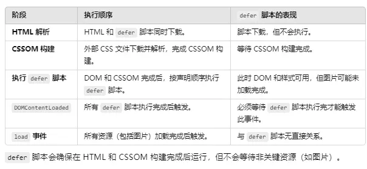

## 一、`link标签`rel属性值`preload`与`prefetch`差异

```html
<link rel="preload" href="" as="script" />
```
注意： 特殊的 as 属性取值：
style 和 script 是最常用的两个值，因为它们分别对应预加载 CSS 和 JavaScript 文件。其他如 image、font 和 audio 也是在处理资源时比较常见的需求。
使用 as 属性时，除了指定合适的资源类型，还可以根据需要指定 type（如字体文件的 MIME 类型）以及 crossorigin（用于跨域请求时指定 CORS 策略）。


### 相同点：
1. 只是利用多余带宽提前加载资源，但js不执行，图片、样式等也主动不引入；
2. 不阻塞dom构建和css渲染，即在页面渲染的同时下载其它资源。

### 不同点：
1. preload优先级高，一般用于当前页面重要资源的提前下载；
2. 而prefetch优先级低，一般用于提前下载子页面等依赖的资源；


## 二、`script标签`之`defer`与`async`属性 差异

```js
<script src="" defer ></script>
```

#### 没有`defer`或`async`
1. `下载`和`执行`均会`阻塞`HTML 解析，适合必须依赖 HTML 内容的脚本。

#### `defer`
1. 不依赖于 DOM 解析完成后的操作，但需要在 DOM 完全加载之后执行的脚本。例如，初始化页面交互、绑定事件等；

2. 与没有 defer 属性的普通`<script>标签`不同，带有 defer 属性的`<script>标签`会延迟执行，但它仍会在页面解析过程中开始异步下载。也就是说，defer 属性让脚本的下载过程异步进行，但不会阻塞页面的其他内容（如 DOM 或其他资源）的加载。

3. 脚本执行顺序：所有带有 defer 属性的脚本会按照它们在文档中的出现顺序来执行，即使它们是异步下载的。也就是说，defer 保证了脚本按顺序执行，而不是基于下载完成的顺序；

4. 多脚本`defer`，保证在html解析及下载依赖css完成后，在脚本依序执行阶段能缓解带宽压力（不过太多的defer在并行加载阶段，也会占用带宽；可结合脚本合并【合并请求】，代码压缩优化），利于首屏加载。

5. 执行时间：这些脚本会在页面解析完成后、DOMContentLoaded 事件触发之前执行。

   
   

*执行顺序图解：*

   sequenceDiagram
    participant Browser
    participant DOM
    participant Resources
    Browser->>DOM: 开始解析HTML
    Browser->>DOM: 构建DOM树
    DOM-->>Browser: DOMContentLoaded触发 (DOM就绪)
    Browser->>Resources: 加载外部资源
    Resources-->>Browser: 所有资源加载完成
    Browser->>Browser: window.onload触发
    Browser->>Browser: document.readyState = 'complete'



*脚本加载策略对比*

graph LR
    A[加载策略] --> B[无属性]
    A --> C[async]
    A --> D[defer]
    B --> B1[阻塞HTML解析]
    B --> B2[声明顺序执行]
    B --> B3[立即执行]
    C --> C1[不阻塞解析]
    C --> C2[下载顺序执行]
    C --> C3[下载完立即执行]
    D --> D1[不阻塞解析]
    D --> D2[声明顺序执行]
    D --> D3[DOMContentLoaded前执行]



<div id = "md-table">

| **场景**                        | **推荐使用**               | **原因说明**                                                                 |
|------------------------------|------------------------|--------------------------------------------------------------------------|
| `修改DOM元素`                  | DOMContentLoaded       | 无需等待资源加载，可尽早操作DOM                                         |
| `获取图片/iframe尺寸`          | window.onload          | 需要确保所有资源已加载才能获得准确尺寸                                  |
| `初始化第三方分析脚本`         | DOMContentLoaded       | 尽早收集用户行为数据                                                    |
| `显示"加载完成"提示`           | document.readyState    | 精确检测最终完成状态                                                    |
| `执行依赖完整布局的JS`         | window.onload          | 如复杂的Canvas绘图需要完整布局信息                                      |
| `预加载后续资源`               | DOMContentLoaded       | 主内容就绪后即可预加载次要资源                                          |
| `单页应用(SPA)挂载`            | DOMContentLoaded       | 现代框架(React/Vue等)通常在此事件挂载应用                               |

</div>


##### 举例
1. 浏览器解析 HTML 文件，从上到下逐行解析。
2. 遇到` <script defer="true" src="script.js"> 标签`时，浏览器会开始异步加载 script.js 文件。
3.  同时，浏览器继续解析页面的其他 HTML 元素，解析 CSS 文件（如 `<link rel="stylesheet" href="styles.css">`），并开始应用 CSS 样式。
4. 当 HTML 文档解析完毕，defer 属性的脚本会按顺序执行，确保文档的 DOM 结构已经完整，但此时 CSS 渲染已经完成。
   （脚本尝试强制触发浏览器对某些样式计算（如 `getComputedStyle`）时可能被延迟，或 JS 存在动态加载额外的 CSS 文件，最好以`onload`监听为准）
5. 在`defer脚本`均执行完成后，`DOMContentLoaded` 事件会被触发。

#### `async`
1. 从`script标签`位置开始下载：浏览器会在解析到 async 属性的`<script>标签`时立即开始下载（`下载过程`不阻塞 html解析）。
2.  下载完成后执行：脚本会在下载完成后立即执行，执行顺序取决于各自下载的顺序，而不是在 HTML 中的顺序（`执行过程`占用主线程，会阻塞 html解析和依赖的css下载，优先执行完毕后才会继续解析html；太多async会抢占带宽，影响css等关键资源加载，有碍页面渲染）。
3.  主要用于“广告”，“监视脚本”或其它第三方独立插件。


## 补充
`<link rel="preload" href="" as="script">`能缩短加载其它页面的时间，但使用太多可能造成流量拥堵，不利于首屏加载。同时与`<script src="" defer />`能提前下载关键资源在且dom完成后顺序执行，是个好实践。
