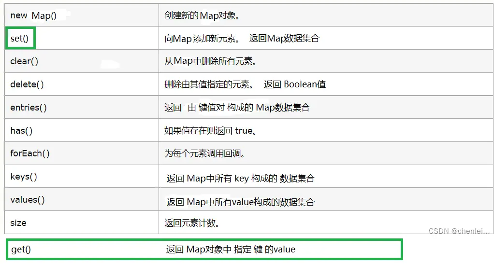
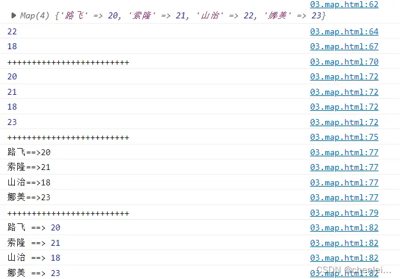
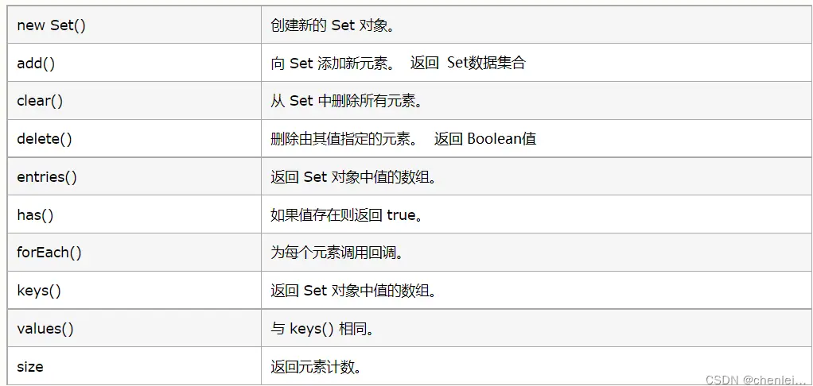

## Map的数据结构：

一组具有键值对的结构,注意参数顺序（key：value），key具有 唯一性 value可有可无，可重复


```js
//写法1：
var m=new Map([['Michael',95],['Bob',75],['Tracy',85]]);
//写法2
var scoreList =[{name:'Tim',age:18,score:90},
                {name:'Tony',age:17,score:95},
                {name:'Kevin',age:18,score:91}];
```
如上为map的数据结构用 二维数组 表示的键值对

### map结构常用方法：
```js
map.set(key,value)---->给map添加键值对元素，返回值类型为空类型
var m=new Map();//添加空的Map
m.set('Adam',67);//添加新的key-value
m.set("Bob",59);
console.log(m)// 结果 { 'Adam' => 67, 'Bob' => 59 }

map.has(key)--->检查map是否含有key，返回值类型为boolean类型
var m=new Map();//添加空的Map
m.set('Adam',67);//添加新的key-value
m.set("Bob",59);
console.log(m.has("Adam"))//true

map.delete(key)---->通过key删除元素
map.set(key,value)---->给map添加键值对元素，返回值类型为空类型
var m=new Map();//添加空的Map
m.set('Adam',67);//添加新的key-value
m.set("Bob",59);
m.delete("Bob")
console.log(m.has("Bob"));//undefined1234567
```

### 需要注意的:

由于一个key只能对应一个value，所以，多次对一个key放入value，后面的值会把前面的值覆盖：
```js
var m =new Map();
m.set('Adam',67);
m.set('Adam',88);
console.log(m.get('Adam'));// 88
```

### map拓展：




```js
<script>
    // map的声明
    let map = new Map();
    // map的赋值
    map.set('路飞', 20);
    map.set('索隆', 21);
    map.set('山治', 22);
    map.set('娜美', 23);
    // 输出map
    console.log(map);
    // 输出map的value
    console.log(map.get('山治'));
    // key不存在就是新增 key存在就是修改
    map.set('山治', 18);
    console.log(map.get('山治'));
    // map遍历
    // 一个参数遍历的是value值
    console.log('+++++++++++++++++++++++++');
    map.forEach(element => {
        console.log(element);
    });
    // 第一个参数是value值 第二个参数值是key
    console.log('+++++++++++++++++++++++++');
    map.forEach((v, k) => {
        console.log(k + '==>' + v);
    });
    console.log('+++++++++++++++++++++++++');
    // for of遍历出的是数组 然后读取数组元素的值拼接
    for (const array of map) {
        console.log(array[0], '==>', array[1]);
    }
</script>
```

## Set的数据结构:

Set和Map类似，也是一组key（唯一性）的集合，但不存储value。由于key不能重复，所以，在Set中，没有重复的key。


用代码表示Set的数据结构：
```js
var set={1，2，3，4}
要创建一个Set,需要提供一个Array作为输入,或者直接创建一个空Set：

var s1 =new Set();// 空Set
var s2 =new Set([1,2,3]);
用于 数组去重:

var s = new Set([1,2,3,3,'3']);
console.log(s);//{1,2,3,"3"}12
```
### Set的常用方法
```js
Set.add(key);---->添加元素，参数为key,可以重复添加，但不会有效果：

var set = new Set([1,2,3]);//初始化Set
 s.add(4);
 s.add(4);
console.log(s);// Set {1, 2, 3, 4}
Set.has(key)—>判断Set中是否有key(元素)

var s = new Set([1,2,3]);
console.log(s.has(4));//false
Set.delete(key)—>删除对应的key

var s = new Set([1,2,3]);
s.delete(3);
console.log(s);//{1,2}
```

### set拓展：



```js
<script>
    // 声明一个集合
    let list = ['路飞', '索隆', '路飞'];
    console.log(list);
    console.log(list.length);
    // 声明一个array集合 可以储存重复的值
    let array = new Array(list);
    console.log(array);
    console.log(array.length);
    // 声明一个set集合 不可以储存重复的值
    let set = new Set(list);
    console.log(set);
    console.log(set.size);
    // 判断元素是否存在
    console.log(set.has('索隆'));
    console.log(set.has('娜美'));
    // 添加元素
    set.add('山治');
    console.log(set);
    // 不会添加重复元素
    set.add('路飞');
    set.add('索隆');
    console.log(set);
    // 遍历set
    set.forEach(element => {
        console.log(element);
    });
    for (const it of set) {
        console.log(it);
    }
</script>
```
