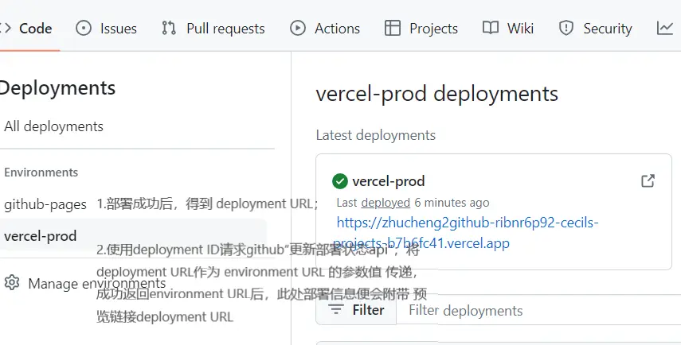
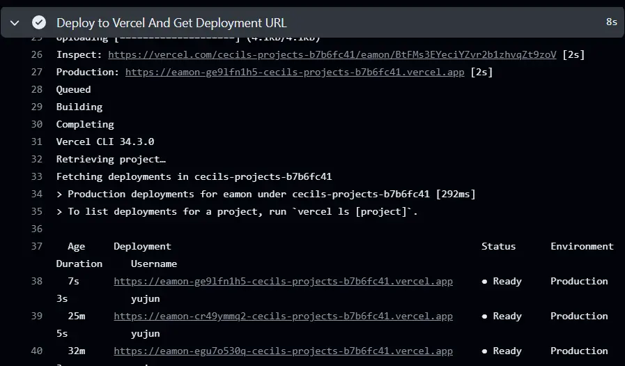
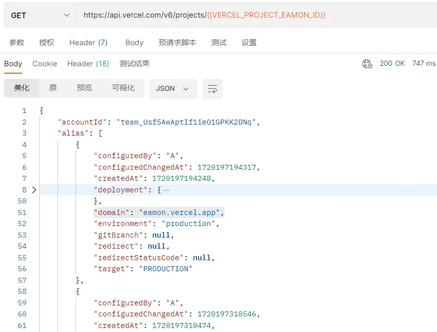
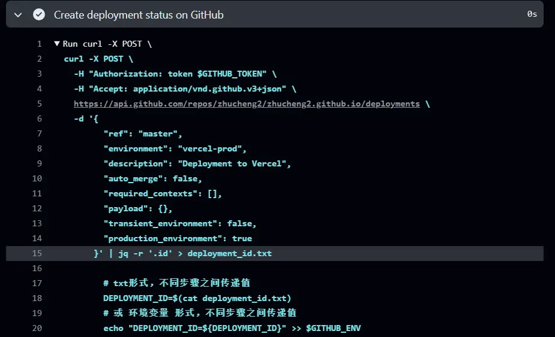
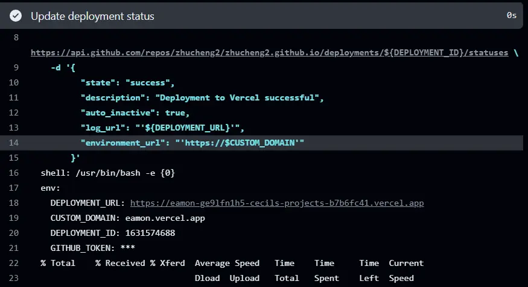

[TOC]


vercel成功部署后，通过githubAPI 将vercel项目的“预览链接” 赋值给github的environment URL
### 效果图


<!-- more -->


### 一、将github仓库项目部署到vercel

可指定项目，“--name“字段貌似可简写为“-n“，后可加“vercel项目名”，或“vercel项目ID”




### 二、得到已关联“vercel项目”的 域名（可选）

vercel项目名”或“vercel项目ID”,请求vercelAPI，以获取项目信息，提取域名。




### 三、创建“github发布状态”

请求githubAPI，“https://api.github.com/repos/${{ github.repository }}/deployments“，会返回此次github提交的“github发布ID”，保存。




### 四、更新“github发布状态”

使用“github发布ID”，请求githubAPI，将vercel平台提供的已部署vercel项目的“预览链接”赋值给github的environment URL




### 五、deploy.yml完整代码（含 github仓库secret）：


```shell
name: Deploy to Vercel

on:
  push:
    branches:
      - master

jobs:
  deploy:
    runs-on: ubuntu-latest
    
    steps:
      - name: Checkout repository
        uses: actions/checkout@v2
    
      - name: Install Vercel CLI
        run: npm install -g vercel
    
      - name: Deploy to Vercel And Get Deployment URL
        id: get-url
        env:
          VERCEL_TOKEN: ${{ secrets.VERCEL_TOKEN }}
        run: |
          # 或不使用"--name"或"-n"指定部署到vercel中已存在的某个项目，而是默认使用git仓库名作为vercel项目名
          # vercel --prod --token ${{ secrets.VERCEL_TOKEN }} --yes
          vercel --prod --token ${{ secrets.VERCEL_TOKEN }} --yes --name ${{secrets.VERCEL_PROJECT_EAMON_ID}}
          DEPLOYMENT_URL=$(vercel --token ${{ secrets.VERCEL_TOKEN }} ls --prod | grep -o 'https://[^ ]*' | head -n 1)
          
          # 1.可设置为 环境变量，在其他步骤使用
          echo "DEPLOYMENT_URL=${DEPLOYMENT_URL}" >> $GITHUB_ENV
          # 2.将 $DEPLOYMENT_URL 的值 赋值给当前作业的 输出变量 DEPLOYMENT_URL，在其他步骤以“steps.get-url.outputs.DEPLOYMENT_URL“形式引用（即将废弃）
          # echo "::set-output name=DEPLOYMENT_URL::$DEPLOYMENT_URL"
          # 3.也可写入txt，在其他步骤使用（查看所有 环境变量，找到 环境变量DEPLOYMENT_URL的键值对，取其值，保存为txt文本 ）
          cat $GITHUB_ENV | grep DEPLOYMENT_URL | cut -d'=' -f2 > DEPLOYMENT_URL.txt
          
          a=$(cat DEPLOYMENT_URL.txt) # 赋值表达式“=“两边 不能有空格
          echo $a
          # 打印变量（含 环境变量）的 3种 方式：echo "我是$a"、echo "我是${a}"、echo $a
    
      - name: Get Vercel Project Info
        env:
          VERCEL_TOKEN: ${{ secrets.VERCEL_TOKEN }}
        run: |
         curl -s -H "Authorization: Bearer $VERCEL_TOKEN" https://api.vercel.com/v6/projects/${{secrets.VERCEL_PROJECT_EAMON_ID}} > vercel_project.json
         cat vercel_project.json
    
      - name: Extract Custom Domain
        run: |
          # 提取 domain
          DOMAIN=$(cat vercel_project.json | jq -r '.alias[0].domain // empty')
          echo "Custom Domain: $DOMAIN"
          echo "CUSTOM_DOMAIN=${DOMAIN}" >> $GITHUB_ENV
          
          # 若vercel平台待部署项目 未关联域名，则使用 DEPLOYMENT_URL作为environment_url【须以https开头】
          if [ -z "$DOMAIN" ]; then
            CUSTOM_DOMAIN=$DEPLOYMENT_URL
          fi
        
      - name: Create deployment status on GitHub
        env:
          GITHUB_TOKEN: ${{ secrets.GITHUB_TOKEN }}
        run: |
          curl -X POST \
            -H "Authorization: token $GITHUB_TOKEN" \
            -H "Accept: application/vnd.github.v3+json" \
            https://api.github.com/repos/${{ github.repository }}/deployments \
            -d '{
                  "ref": "master",
                  "environment": "vercel-prod",
                  "description": "Deployment to Vercel",
                  "auto_merge": false,
                  "required_contexts": [],
                  "payload": {},
                  "transient_environment": false,
                  "production_environment": true
                }' | jq -r '.id' > deployment_id.txt
    
                  # txt形式，不同步骤之间传递值
                  DEPLOYMENT_ID=$(cat deployment_id.txt)
                  # 或 环境变量 形式，不同步骤之间传递值
                  echo "DEPLOYMENT_ID=${DEPLOYMENT_ID}" >> $GITHUB_ENV
          
      - name: Update deployment status
        env:
          GITHUB_TOKEN: ${{ secrets.GITHUB_TOKEN }}
        run: |
          DEPLOYMENT_URL=$(cat DEPLOYMENT_URL.txt)
          DEPLOYMENT_ID=$(cat deployment_id.txt)
          # 或 环境变量 DEPLOYMENT_ID=${{env.DEPLOYMENT_ID}}
          curl -X POST \
            -H "Authorization: token $GITHUB_TOKEN" \
            -H "Accept: application/vnd.github.v3+json" \
            https://api.github.com/repos/${{ github.repository }}/deployments/${DEPLOYMENT_ID}/statuses \
            -d '{
                  "state": "success",
                  "description": "Deployment to Vercel successful",
                  "auto_inactive": true,
                  "log_url": "'${DEPLOYMENT_URL}'",
                  "environment_url": "'https://$CUSTOM_DOMAIN'"
                }'
```


###  六、注意事项

“jobs输出变量”、“环境变量”在json中的不同书写方式，注意“引号”。
```shell
# job输出变量 书写

# "environment_url": "'${{steps.get-url.outputs.DEPLOYMENT_URL}}'"

# 环境变量 书写

# "log_url": "'"${{ env.DEPLOYMENT_URL }}"'",

# "environment_url": "'${ DEPLOYMENT_URL }'"

# "environment_url": "'$DEPLOYMENT_URL'"
```

