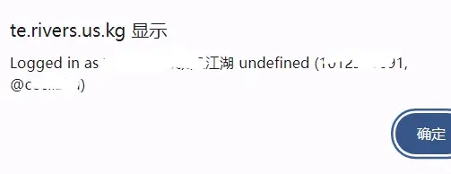

[TOC]
## 注意

> 一、电报机器人快捷认证登录，登录成功后会返回 昵称，会话ID，和 用户名。
> 二、只能作为验证身份，获取用户部分信息使用。本地退出只能通过清除浏览器cookie中的token，若要完全退出该浏览器认证终端，须在 Telegram 手动终止。

## 效果（验证）:

<strong></strong>
<script type="text/javascript">
  function onTelegramAuth(user) {
    alert('Logged in as ' + user.first_name + ' ' + user.last_name + ' (' + user.id + (user.username ? ', @' + user.username : '') + ')');
  }
</script>


直接进入当前页面 无 授权登录按钮，须在 科学条件 下，刷新 当前页面 才可看到该 授权登录按钮！！


<script defer src="https://telegram.org/js/telegram-widget.js?22"
data-telegram-login="Cecilzhubot"
data-size="large"
data-radius="20"
data-onauth="onTelegramAuth(user)"
data-request-access="write"></script>


须在 科学条件 下，才可看到该 授权登录按钮，无需二次刷新页面！！

<style>
   iframe {
      width: 100%; /* 调整宽度 */
      height: 100px; /* 调整高度 */
      border: none;
      border-radius: 20px;
    }
</style>
<iframe src="/posts/telegram-ce-shi/telegram-widget"></iframe>

<strong></strong>
1.登陆前，


2.在已登录telegram的设备中，进行第三方登录的确认，


3.登陆成功后，




4.退出，须清理对应cookie记录。


## 主要代码如下：

```html
<script type="text/javascript">
  function onTelegramAuth(user) {
    alert('Logged in as ' + user.first_name + ' ' + user.last_name + ' (' + user.id + (user.username ? ', @' + user.username : '') + ')');
  }
</script>

<div class="telegram-container">
<h1>使用 Telegram 登录</h1>
<script async src="https://telegram.org/js/telegram-widget.js?22"
data-telegram-login="Cecilzhubot"
data-size="large"
data-radius="20"
data-onauth="onTelegramAuth(user)"
data-request-access="write"></script>
</div>
```

