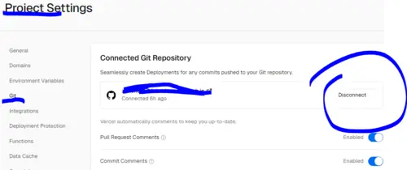
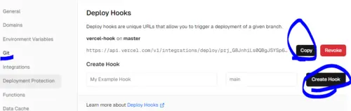
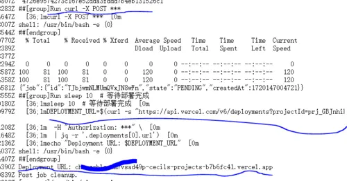

[TOC]

<!-- more -->

#### 一、本地vercel-cli手动部署
在本地npm安装vercel-cli插件，cd 到本地项目目录；
选取第三方账号等方式，远程登录vercel，选择 待发布的 vercel项目名；
发布项目到 预览环境，或`vercel --prod`生产环境，成功后会输出 预览链接。


#### 二、vercel面板 直接部署
登录vercel面板，导入github仓库，直接发布。
只要不断开vercel与git仓库的链接，git仓库有新推送，vercel便会同步部署。




#### 三、github actions + VERCEL_TOKEN

登录vercel面板，新建一个token，并存入到github仓库中的“仓库secret”处，取名为VERCEL_TOKEN；
新建work actions，在`.github/workflows/deploy.yml`中利用${{secrets.VERCEL_TOKEN}}自主地 部署项目到 vercel平台。

解释：部署到生产命令`vercel --prod`结束后会输出一段信息，进而通过`| grep -o`过滤出这段信息中的“预览链接”，而变量`DEPLOYMENT_URL`会通过`$()`接收这个链接字符串。之后保存到deployment_output.txt中。

   ```shell
   name: Deploy to Vercel
   on:
     push:
       branches:
         - master  # 当推送到 master 分支时触发
   jobs:
     deploy:
       runs-on: ubuntu-latest
       environment: vercel-prod  # 设置环境为 vercel    
       steps:
         - name: Checkout repository
           uses: actions/checkout@v2
   
         - name: Install Vercel CLI
           run: npm install -g vercel
   
         - name: Deploy to Vercel
           env:
             VERCEL_TOKEN: ${{ secrets.VERCEL_TOKEN }}
           run: |
             # 执行一次部署，并从部署成功的输出日志中，提取当前的 部署成功url
             DEPLOYMENT_URL=$(vercel --prod --token ${{ secrets.VERCEL_TOKEN }} --yes | grep -o 'https://[a-zA-Z0-9./?=_-]*')
             # 或 从所有生产部署的输出日志中，查找到所有的 部署成功url，获取最新的url
             # DEPLOYMENT_URL=$(vercel --token ${{ secrets.VERCEL_TOKEN }} ls --prod | grep -o 'https://[^ ]*' | head -n 1)
             echo $DEPLOYMENT_URL > deployment_output.txt
           id: deploy
   
         - name: Output Deployment URL
           run: cat deployment_output.txt
           if: success()
   
   ```


#### 四、github actions触发vercel-hook

登录vercel面板，申请一个直接交给github actions的执行的，用于vercel部署的hook钩子；
将该hook钩子存入到github仓库中的“仓库secret”处，取名为VERCEL_DEPLOY_HOOK；只要githubAction中触发该hook即可强制部署：

   ```
   - name: Trigger Vercel Deploy Hook
           run: curl -X POST ${{ secrets.VERCEL_DEPLOY_HOOK }}
   ```

   


另外，可结合vercel中的`PROJECT_ID`和`VERCEL_TOKEN`,访问接口`https://api.vercel.com/v6/deployments?projectId=YOUR_PROJECT_ID`，获取最近的部署信息，进一步获取部署成功的 项目链接：

   ```
   - name: Get Deployment URL
           run: |
             sleep 10  # 等待部署完成
             DEPLOYMENT_URL=$(curl -s "https://api.vercel.com/v6/deployments?projectId=YOUR_PROJECT_ID" \
               -H "Authorization: Bearer ${{ secrets.VERCEL_TOKEN }}" \
               | jq -r '.deployments[0].url')
             echo "Deployment URL: $DEPLOYMENT_URL"
   ```

 

完整版：

   ```shell
   name: Deploy to Vercel
   
   on:
     push:
       branches:
         - master  # 当推送到 master 分支时触发
   
   jobs:
     deploy:
       runs-on: ubuntu-latest
   	environment: vercel-prod
       steps:
         - name: Checkout repository
           uses: actions/checkout@v2
   
         - name: Trigger Vercel Deploy Hook
           run: curl -X POST ${{ secrets.VERCEL_DEPLOY_HOOK }}
   
         - name: Get Deployment URL
           run: |
             sleep 10  # 等待部署完成
             DEPLOYMENT_URL=$(curl -s "https://api.vercel.com/v6/deployments?projectId=YOUR_PROJECT_ID" \
               -H "Authorization: Bearer ${{ secrets.VERCEL_TOKEN }}" \
               | jq -r '.deployments[0].url')
             echo "Deployment URL: $DEPLOYMENT_URL"
   
   ```


输出日志：

 


#### 五、总结

> 除了第一种 `本地vercel-cli`，其他（vercel Deployment Hook，github action）方式，只要git远程仓库有新推送，便自动部署项目到 vercel平台；当在主支推送时，默认部署至vercel生产环境。
