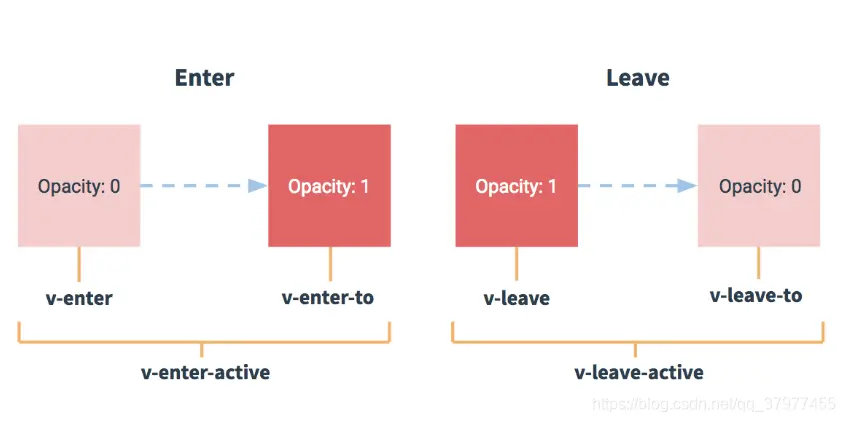

>  ## **transition分为以下 六个阶段：**
>  * enter, enter-active, enter-active-to,  
>  * (开始 进入阶段的)第1帧 **属性值**，*到* (**默认属性值** 的*过渡阶段*)，移除enter动画，  
> * leave, leave-active, leave-active-to  
> * (开始 离开 阶段的)第1帧 **默认属性值**，*到* (**属性值** 的*过渡阶段*)，移除leave动画

## 2种使用：

```vue
<transition name="slide"></transition>
```

```css
 /* 正常状态下detail组件默认为transformX(0) */
.slide-enter,
.slide-leave-to {
  transform : translateX(100%);
}
.slide-enter-active,
.slide-leave-active { transition: all .6s;}
```

不考虑过渡速率，与下同，
```css
@keyframes slideMove{
    0%{ transform : translateX(100%); }
    100%{ transform : translateX(0); }
}
.slide-enter-active { animation: .6s slideMove;}
.slide-leave-active { animation: .6s slideMove reverse;} /* 动画顺序翻转 */
```
