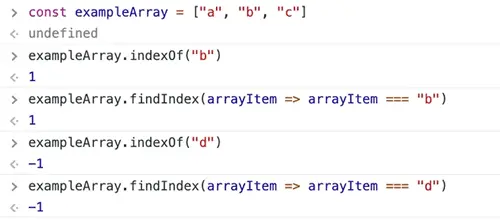
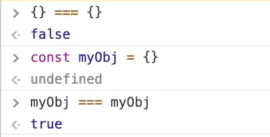
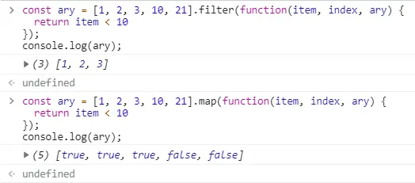

[TOC]


## 一、字符串操作

### 切割、合并、截取
#### split
函数：String.split(separator, ?limit)

功能：使用一个指定的分隔符把一个字符串分割存储到数组
```js
const str = 'jpg|bmp|gif|ico|png';
let arr = str.split('|'); // [jpg, bmp, gif, ico, png]
let arr = str.split('|', 2); // [jpg, bmp] - 第二个参数用来限制数组大小
```
#### concat
函数：String.concat(...strings)

功能：将多个字符串依次并在String的后面
```js
'start'.concat(', ', 'hello', ' world') // start, hello world
```
#### slice、substring、substr比较
##### 函数：String.slice(start, ?end)
start：必填。指定子字符串开始位置，默认为0。可以为负数，-1表示最后一位，-2表示倒数第二位。
end：可选。指定子字符串结束位置，可以为负数。如果未指定此参数，则表示从start到字符串结束的子字符串。
return：返回子字符串，包含从start到end-1的所有字符，长度 为“end减start”，即“包前 不包后”！
##### 函数：String.substring( start, ?end)
start：必填。非负整数，指定子字符串开始位置。如果start为负数，自动替换为0
end：可选。非负整数，指定子字符串结束位置。如果end为负数，自动替换为0
return：返回子字符串，包含从start到end-1的所有字符，长度 为“end减start”，即“包前 不包后”！
如果start比end大，那么会先交换两个参数再截取字符串
##### 函数：String.substr( from, ?length)
from：必填。指定子字符串开始位置。可以为负数，-1表示最后一位，-2表示倒数第二位。
length：可选。待选取字符串的长度。0或负数返回空字符串，不指定，则子字符串延续到字符串的最后。
return：返回子字符串，包含从start起，截取的length长度的字符串。

```js
'012345'.slice() // 012345
'012345'.substring() // 012345
'012345'.substr() // 012345
'012345'.slice(1) // 12345
'012345'.substring(1) // 12345
'012345'.substr(1) // 12345
'012345'.slice(-2) // 45
'012345'.substring(-2) // 012345	| * 负数替换为0，变成substring(0)
'012345'.substr(-2) // 45
'012345'.slice(1, 3) // 12	| *  位置1到3-1的字符串
'012345'.substring(1, 3) // 12	| * 位置1到3-1的字符串
'012345'.substr(1, 3) // 123	| * 从1起长度为3的字符串
'012345'.slice(3, 1) // ''	| * 从位置3到1，截取不到字符
'012345'.substring(3, 1) // 12	| * start,end互换，变成substring(1，3)
'012345'.substr(3, 1) // 3	| * 从位置3起截取，长度为1
'012345'.slice(-3, -1) // 34	| * 倒数第3位到（倒数第1位-1）的字符串
'012345'.substring(-3, -1) // ''	| * 负数替换为0，变成substring(0, 0)
'012345'.substr(-3, -1) // ''	| * length为负数，没有长度，返回空字符串
```
##### 小结：

1. slice, substring根据位置截取字符串；substr根据长度截取。
2. substring的start/end的有效值为非负整数，slice的start/end, substr的from可以为负数。
3. 第二个参数不提供（end, length)，则截取到字符串末尾。
4. 只有substring会 根据大小自动调整start, end的先后，以截取到有效字符串。


### 查找替换
#### indexOf、lastIndexOf
函数：String.indexOf(searchString, ?position), String.lastIndexOf(searchString, ?position)

功能：indexOf从字符串开始位置向后 查找指定字符串的位置，lastIndexOf相反，从字符串尾部向前查找


```js
'hello world'.indexOf('o') // 4
'hello world'.indexOf('llo')//2  返回'llo'子串 首字母 的索引
'hello world'.indexOf('o', 5) // 7	| * 从空格处(index=5)开始向后查找
'hello world'.lastIndexOf('o', 7) // 7
'hello world'.lastIndexOf('o', 5) // 4	| * 从空格处(index=5)开始向前查找
```
#### charAt
函数：String.charAt(index)

功能：返回指定位置的字符。字符串中第一个字符的下标是0。如果参数 index 不在 0 与 string.length 之间，该方法将返回一个空字符串''若通过String[索引]方式查找不到 目标字符，返回的是undefined

```js
'0123456'.charAt(4) // 4
'0123456'.charAt(10) // ''
```
#### charCodeAt
函数：String.charCodeAt(index)

功能：返回 指定位置 字符 在 Unicode字符集上对应 码点的 十进制值（相当于下面String.fromCharCode() 的逆操作！）。这个返回值是 0 - 65535 之间的整数。如果参数 index 不在 0 与 string.length 之间，该方法将返回NaN。

注意，charCodeAt 方法返回的 Unicode 码点不会大于 65536（0xFFFF），也就是说，只返回两个字节的字符的码点。如果遇到码点大于 65536 的字符（四个字节的字符），必需连续使用两次 charCodeAt，不仅读入charCodeAt(i)，还要读入 charCodeAt(i+1)，将两个值放在一起，才能得到准确的字符。

##### 拓展：或者直接使用codePointAt() ，codePointAt() 可以 返回 大于 0xFFFF (65535) 的 Unicode 值的完整值。
```js
'0123456'.charCodeAt(4) // 52'0123456'.charCodeAt(-1) // NaN
'0123456'.charCodeAt(10) // NaN
```
#### fromCharCode
函数：String.fromCharCode(n1, n2, …, nX)

功能：可接受一个指定的 Unicode 值，然后返回一个字符串。
```js
var n = String.fromCharCode(72,69,76,76,79);//HELLO
```
#### replace
函数：String.replace(searchValue, replaceValue)


```js
'bone, alone, phone'.replace('one', 1) // b1, alone, phone
'bone, alone, phone'.replace(/one/g, 1) // b1, al1, ph1
```
#### trim
函数：String.trim()

功能：去除字符串首尾空格

trim在ES5已定义，且大多数浏览器已支持，不再需要自己实现。详见：trim on MDN
```js
'hello'.trim() // 'hello'
```
### 字符串操作 其它方法
#### strartsWith/endsWith
函数：String.strartsWith()/String.endsWith()。功能：判断 字符串首、尾是否以 目标子字符串 开头、结尾。返回boolean值。

#### toUpperCase/toLowerCase
函数：String.toUpperCase()/String.toLowerCase()。功能：字母转大、小写。

#### 注意：
通过对 string[索引] 赋值方式，并不能改变 目标string，只能对 新变量 并进行赋值才能改变。要与数组操作区分开！！！


## 二、数组操作
### 数组整体 操作
#### join
函数：Array.join(?separator)

功能：通过指定的分隔符将数组项连接合并为一个字符串，参数不传则默认为","
```js
const arr = ['jpg', 'bmp', 'gif', 'ico', 'png']
let str = arr.join('|') // jpg|bmp|gif|ico|png
```
#### reverse
功能：将函数项颠倒顺序，会改变 原数组
```js
const ary = [1, 2, 3]
ary.reverse()
console.log(ary) // [3,2,1]
```
#### concat
功能：将多个数组合并，不改变原数组
```js
const ary = ['cat']
const newary = ary.concat(['hat'], ['bat', 'fat'])
console.log(newary) // ["cat", "hat", "bat", "fat"]
```
### 数组项 操作
（3种 查找 数组元素的方法：includes、indexOf/lastIndexOf、Array.find/Array.findIndex。前2种也适用于 查找字符串！！）

#### includes
用处：判断 数组 是否包含 指定的元素。或者 字符串 是否包含指定的 子字符串。返回boolean值

#### indexOf, lastIndexOf
功能：indexOf（searchElement, position），searchElement为需要查找的元素，position为开始查找的位置。

从前往后查找满足条件的 第一项索引，找到了就返回该索引，找不到 返回-1。lastIndexOf相反。
```js
const ary = ["cat", "hat", "cat", "fat"]
const index = ary.indexOf('cat') // 0
const lastIndex = ary.lastIndexOf('cat') // 2
```
#### Array.find
遍历数组中的元素，找到满足条件的元素，就返回 第一个 满足该条件元素的 值；找不到，就返回undefined。

有3个参数。item：每一次迭代查找的数组元素。index：每一次迭代查找的数组元素索引。array：被查找的数组。
```js
const arr = [1, 2, 6, 5, 12];
var res = arr.find((item, index, arr) => {
  return item > 4;
});
console.log(res);//6 数组中 大于4的 第一个元素 是6 

var res = arr.find((item, index, arr) => {
  return item > 14;
});
console.log(res);//undefined 数组中 不包含 大于14的元素

var res = arr.find((item, index, arr) => {
  return item == 6;//【判断 数组中是否包含 某元素！】
});
console.log(res);//6  数组中 包含 值为6 的元素
```
#### Array.findIndex
遍历数组中的元素，找到满足条件的元素，就返回 第一个 满足该条件元素的 索引；找不到，就返回-1。三个参数同上！
```js
const arr = [1, 2, 6, 5, 12];
var res = arr.findIndex((item, index, arr) => {
  return item > 4;
});
console.log(res);//2 数组中 大于4的 第一个元素的 索引 是5 

var res = arr.findIndex((item, index, arr) => {
  return item > 14;
});
console.log(res);//-1 数组中 不包含 大于14的元素

var res = arr.findIndex((item, index, arr) => {
  return item == 6;//【判断 数组中是否包含 某元素！】
});
console.log(res);//2  数组中 包含 值为6 的元素，其 索引 是2
```
##### 拓展：
findIndex 与 indexOf 的主要区别在于 findIndex 接受回调作为参数，而 indexOf 接受值作为参数。

这意味着 indexOf 只会在数组中查找值，而 findIndex 将让你 决定如何查找索引。

查找数组中是否存在 某元素，是使用 findIndex 还是 indexOf ？？？？

若要查找的数组元素是 基本类型，两种方法没有区别。




##### 若要查找 数组中 对象 的索引，会有什么差别吗？？？




正如在 indexOf 中看到的那样，即使我们提供了一个相同的对象，但没有指向同一个引用，它也无法在数组中找到它。

使用 findIndex 允许我们检查数组中每个对象的属性、键和值，因此它可以在数组中找到正确的项目并返回索引。

最后，因为我们把引用传递给最后一个 indexOf 方法，它可以在数组中找到正确的项，因为引用相等。

##### 结论：如果你正在搜索更复杂的值（例如对象），请使用Array.prototype.findIndex 以便你可以通过搜索每个对象的键、值和属性来找到正确的索引。

#### push
功能：数组尾部插入一个项，会改变原数组。返回值为插入后的 数组长度。

const ary = ['head', 'tail']
const length = ary.push('hello')
console.log(ary) // ['head', 'tail', 'hello']console.log(length) // 3

#### pop
功能：数组尾部移除一个项，会改变原数组。返回值为移除的项。

const ary = ['head', 'tail']
const item = ary.pop()
console.log(ary) // ['head']
console.log(item) // 'tail'

#### unshift
功能：数组头部插入一个项，会改变原数组。返回值为插入后的 数组长度。

const ary = ['head', 'tail']
const length = ary.unshift('hello')
console.log(ary) // ['hello'，'head', 'tail']
console.log(length) // 3
#### shift
功能：数组头部移除一个项，会改变原数组。返回值为移除的项。

const ary = ['head', 'tail']
const item = ary.shift()
console.log(ary) // ['tail']
console.log(item) // 'head'
#### slice
函数：Array.slice(?start, ?end)

功能：数组项的截取，返回一个 新数组。不改变 原数组！！！！！


```js
const ary1 = [0,1,2,3,4,5].slice() // [0,1,2,3,4,5]
const ary2 = [0,1,2,3,4,5].slice(3) // [3,4,5]
const ary3 = [0,1,2,3,4,5].slice(3, 5) // [3,4]
const ary4 = [0,1,2,3,4,5].slice(3, -1) // [3,4]	| * end = -1 + 6 = 5， 倒数第一项
const ary5 = [0,1,2,3,4,5].slice(-2, -1) // [4]
```
#### splice
函数：Array.splice(start, ?deleteCount, ...items)

功能：可以对数组进行添加删除，间接实现替换功能。会改变原数组。


```js
let ary = [0, 1, 2, 3, 4, 5]
let res = ary.splice(2) // 从2的位置起，向后删除所有项
console.log(ary, res) // ary = [0, 1], res = [2, 3, 4, 5]

ary = [0, 1, 2, 3, 4, 5]
res = ary.splice(2, 1) // 从2的位置起，删除1个项
console.log(ary, res) // ary = [0, 1, 3, 4, 5], res = [2]

ary = [0, 1, 2, 3, 4, 5]
res = ary.splice(2, 3) // 从2的位置起，删除3个项
console.log(ary, res) // ary = [0, 1, 5], res = [2, 3, 4]

ary = [0, 1, 2, 3, 4, 5]
res = ary.splice(2, 1, 'hello') // 从2的位置起，删除1个项, 同时在2的位置添加一个项（间接实现替换功能）
console.log(ary, res) // ary = [0, 1, 'hello', 3, 4, 5], res = [2]

ary = [0, 1, 2, 3, 4, 5]
res = ary.splice(2, 3, 'hello') // 从2的位置起，删除3个项, 同时在2的位置添加一个项
console.log(ary, res) // ary = [0, 1, 'hello', 5], res = [2, 3, 4]

ary = [0, 1, 2, 3, 4, 5]
res = ary.splice(2, 1, 'hello', 'world') // 从2的位置起，删除1个项, 同时在2的位置依次添加多个项
console.log(ary, res) // ary = [0, 1, 'hello', 'world', 3, 4, 5], res = [2]

ary = [0, 1, 2, 3, 4, 5]
res = ary.splice(2, 3, 'hello', 'world') // 从2的位置起，删除3个项, 同时在2的位置依次添加多个项
console.log(ary, res) // ary = [0, 1, 'hello', 'world', 5], res = [2, 3, 4]

ary = [0, 1, 2, 3, 4, 5]
res = ary.splice(2, 0, 'hello', 'world') // 从2的位置起，删除0个项, 同时在2的位置依次添加多个项【索引2的位置被 替换元素占用。之前索引2、及之后的元素，整体后移】
console.log(ary, res) // ary = [0, 1, "hello", "world", 2, 3, 4, 5], res = []
```

### 迭代操作
#### sort
功能：默认 按照数组项的字符的unicode排序，如果不是字符串，调用toString转为字符串。
```js
const ary = [1, 2, 10, 3]
ary.sort()
console.log(ary) // [1, 10, 2, 3]	| * 10转成字符串'10'
```

用法：数字的升、降序 [只适用于 数字间，不适用ascii比大小]
```js
// 升序
const aryUp = [1, 2, 10, 3]
aryUp.sort(function(a,b){//a在前，b在后
    return a-b;// 满足a-b>0,即a>b时，a,b值交换位置。换位置后a小b大，达到 升序
});
console.log(aryUp); // [1, 2, 3, 10]

// 降序
const aryDown = [1, 2, 10, 3]
aryDown.sort(function(a,b){//a在前，b在后
    return b-a;// 满足b-a>0,即b>a时，a,b值交换位置。换位置后a大b小，达到 降序
});
console.log(aryDown); // [10, 3, 2, 1]
```

#### for...in...
##### for(var index in Array)
index 为Array中的 索引。【访问 数组元素 使用array[index]】

补充：数组作为一个对象，为避免遍历其原型链上的 一些共有属性。可能会需要Reflect.ownKeys(arr)或Object.getOwnPropertyNames(arr)。返回所有自有属性key，不管是否可枚举，但不包括 继承自原型的属性。

##### for(var key in Object)
index 为Object中的 key【访问 对象的值 使用object[key]，其中key是string类型；遍历对象的可枚举属性，包括自有属性、继承自原型的属性】

#### for...of...
for(var item of Array/String/map/set等拥有迭代器对象的集合，不能遍历 对象)
item 为Array中的 元素，或String中的 字符。

#### forEach
功能：数组遍历,没有返回值。无法响应break、continue和return语句，直至遍历结束。

['a', 'b', 'c'].forEach(function(item, index, array) {
    console.log(item, index, array)
    // a 0 ['a', 'b', 'c'];
    // b 1 ['a', 'b', 'c']; 
    // c 2 ['a', 'b', 'c'];
})
#### map
功能：遍历数组各项，并 返回一个 新数组【数组被处理后，数组长度 不变，但元素本身 可能发生改变】

const ary = ['a', 'b', 'c'].map(function(item, index, ary) {
  return item.charCodeAt(0)
})
console.log(ary) // [97, 98, 99]
#### filter
功能：遍历数组各项，根据判断条件，过滤出（返回）符合条件的元素 所组成的数组【元素个数 可能少于原数组，但 不改变元素本身】

const ary = [1, 2, 3, 10, 21].filter(function(item, index, ary) {
  return item < 10
})
console.log(ary) // [1, 2, 3]
#### filter 与 map的简单比较：



#### every, some
功能：


（注意：[].every(ele => {return ele})，整体返回true）

对于一个 []，在 [] 中,没有任何元素 违反了 判断条件，因此 .every() 方法会直接返回 true。

```js
let res = [1, 2, 3, 10, 21].every(function(item, index, ary) {
 	return item < 100
})
console.log(res) // true

res = [1, 2, 3, 10, 21].some(function(item, index, ary) {
	console.log(item) // 1 只执行了一次
 	return item < 100
})
console.log(res) // true

res = [1, 2, 3, 10, 21].some(function(item, index, ary) {
	console.log(item) // 1 2 3 10 21 遍历了全部
 	return item > 100
})
console.log(res) // false
```

#### reduce, reduceRight
[具体用法详见：JS Array.reduce 理解与使用 - 简书](https://www.jianshu.com/p/5e962d1b9844)

函数：array.reduce(function(total, currentValue, currentIndex, arr), initialValue)

功能：聚合数组项，根据聚合函数生成最后结果。当没有指定initialValue时，reduce从第一个元素开始，从左向右聚合，reduceRight相反。【total为上次循环的 结果集，currentValue为array遍历的当前项】
```js
let res = [1, 2, 3, 4, 5].reduce(function(a, b) {
  return a + b
})
console.log(res) // 1 + 2 + 3 + 4 + 5 = 15

res = [1, 2, 3, 4, 5].reduce(function(a, b) {
  return a + b
}, 10) // 初始值console.log(res) // 10 + 1 + 2 + 3 + 4 + 5 = 25

res = [1, 2, 3, 4, 5].reduce(function(a, b) {
  return a - b
})
console.log(res) // 1 - 2 - 3 - 4 - 5 = -13

res = [1, 2, 3, 4, 5].reduceRight(function(a, b) {
  return a - b
})
console.log(res) // 5 - 4 - 3 - 2 - 1 = -5

res = [1, 2, 3, 4, 5].reduceRight(function(a, b) {
  return a - b
}, 1) // 初始值console.log(res) // 1 - 5 - 4 - 3 - 2 - 1 = -14
```

### 小结
#### 会改变 原数组的操作：reverse, sort, splice, push, pop, shift, unshift

## 三、字符串 与 数组 的一些同名操作
### slice
const str = '012345'.slice(1,3) // '12'
const ary = [0,1,2,3,4,5].slice(1,3) // [1,2]
### concat
const str = 'start'.concat(', ', 'hello', ' world') // start, hello world
const ary = ['start'].concat([',', ' hello'], ['world']) // ['start', ',', ' hello', 'world']
### includes
用处：判断 数组 是否包含 指定的元素。或者 字符串 是否包含指定的 子字符串。返回boolean值

arr = [1, 2, 3, 4];
str = 'sdfga';
console.log(arr.includes(2));//true
console.log(arr.includes(6));//false
console.log(str.includes('df'));//true
console.log(str.includes('h'));//false
### indexOf, lastIndexOf
const index1 = 'hello world'.indexOf('o') // 4
const index2 = ['hello'，'world'].indexOf('world') // 1
const index3 = 'hello world'.lastIndexOf('o') // 7
const index4 = ['hello'，'world'].lastIndexOf('world') // 1
