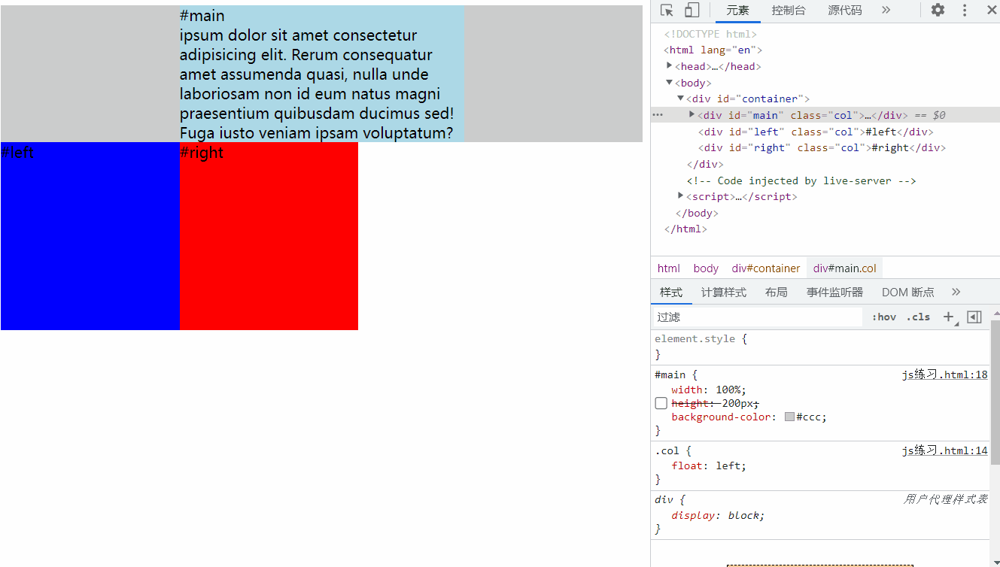
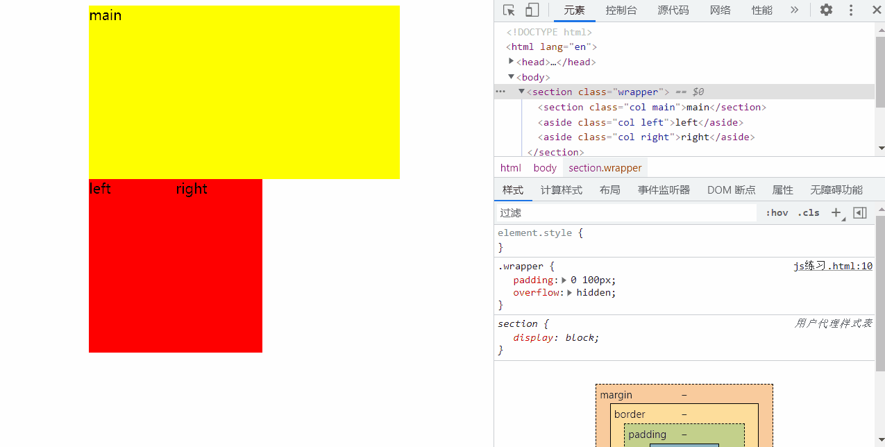

一、中间 自适应，左右两边 宽度固定

### 方法1：box容器 Flex布局，center设置为 flex:1
```html
<!DOCTYPE html>
<html lang="en">
<head>
    <meta charset="UTF-8">
    <meta http-equiv="X-UA-Compatible" content="IE=edge">
    <meta name="viewport" content="width=device-width, initial-scale=1.0">
    <title>Document</title>
    <style type="text/css">
        #box {
            width: 100%;
            height: 100px;
            display: flex;
            margin: 10px;
        }

        #left,
        #right {
            width: 200px;
            height: 100px;
            margin: 10px;
            background-color: #999;
        }

        #center {
            flex: 1;
            height: 100px;
            margin: 10px;
            /*左右margin不会叠加*/
            background-color: #f00;
        }
    </style>
</head>

<body>
    <div id="box">
        <div id="left">left</div>
        <div id="center">center</div>
        <div id="right">right</div>
    </div>
</body>

</html>
```

### 方法2：左、右两栏 分别 float:left、float:right。center左右margin，或者激活center的BFC
```html
<!DOCTYPE html>
<html lang="en">
<head>
    <meta charset="UTF-8">
    <meta http-equiv="X-UA-Compatible" content="IE=edge">
    <meta name="viewport" content="width=device-width, initial-scale=1.0">
    <title>Document</title>
    <style type="text/css">
        .left,
        .right {
            width: 200px;
            height: 200px;
            background-color: #999;
        }

        .left {
            float: left;
        }

        .right {
            float: right;
        }

        .center {
            /* 方式二、 */
            /* margin: 0 200px; */

            overflow: hidden;
            /* 方式一、激活center的BFC，使之无法被 两边的浮动元素 覆盖*/

            height: 300px;
            background-color: #f00;
        }
    </style>
</head>

<body>
    <!--该布局法的好处是受外界影响小，但是不足是 三个元素的顺序，center一定要放在最后，这是            	
        和绝对定位不一样的地方，center占据文档流位置，所以一定要放在最后，左右两个元素位置没有关系。
        当浏览器窗口很小的时候，右边元素会被挤到下一行。-->
    <div class="left">left</div>
    <div class="right">right</div>
    <div class="center">center</div>
</body>

</html>
```

### 方法3：左、右两栏 分别 绝对定位，center左右margin
```html
<!DOCTYPE html>
<html lang="en">

<head>
    <meta charset="UTF-8">
    <meta http-equiv="X-UA-Compatible" content="IE=edge">
    <meta name="viewport" content="width=device-width, initial-scale=1.0">
    <title>Document</title>
    <style type="text/css">
        /*左右固定，中间自适应  利用绝对定位*/
        .container {
            width: 100%;
            height: 100%;
            position: relative;
        }

        .left {
            position: absolute;
            left: 0;
            top: 0;
            width: 400px;
            height: 200px;
            background-color: black;
            color: #fff;
        }

        .center {
            margin: 0 400px;
            overflow: hidden;
            height: 400px;
            background-color: yellow;
        }

        .right {
            position: absolute;
            top: 0;
            right: 0;
            width: 400px;
            height: 300px;
            background-color: red;
        }
    </style>
</head>

<body>
    <div class="container">
        <div class="left">left</div>
        <div class="center">center</div>
        <div class="right">right</div>
    </div>
</body>
</html>
```

### 方法4：三栏都 float: left；对center的宽度 进行 calc()计算
```html
<!DOCTYPE html>
<html lang="en">
<head>
    <meta charset="UTF-8">
    <meta http-equiv="X-UA-Compatible" content="IE=edge">
    <meta name="viewport" content="width=device-width, initial-scale=1.0">
    <title>Document</title>
    <style type="text/css">
        .container {
            overflow: hidden;
        }

        .left,
        .right {
            float: left;
            width: 100px;
            background: red;
        }

        .center {
            float: left;
            width: calc(100% - 200px);
            background: yellow;
        }
    </style>
</head>

<body>
    <div class="container">
        <div class="left">left</div>
        <div class="center">center</div>
        <div class="right">right</div>
    </div>
</body>

</html>
```

###  方法5：双飞翼布局（重点）优先显示 main主要部分 !


分析：
1.首先container只是一个三栏布局整体的包裹，不是布局重点。main占据整行，main的子元素main-wrap才是中间的内容区域。main-wrap设置 左、右margin的目的是为left、right两栏留空。
2.三栏都 float: left；
3.中间栏width:100%；左栏margin-left: -100%； 右栏 （负 自身宽度） margin-left: -190px
（解释：由于main宽100%，此时left、right两栏都被挤到第二行。设置各自的 “负margin-left值”使它们分别移动到 第一行的左右两边）


```html
<!DOCTYPE html>
<html lang="en">
<head>
    <meta charset="UTF-8">
    <meta http-equiv="X-UA-Compatible" content="IE=edge">
    <meta name="viewport" content="width=device-width, initial-scale=1.0">
    <title>Document</title>
    <style type="text/css">
        body {
            min-width: 550px;
        }

        .col {
            float: left;
        }

        #main {
            width: 100%;
            /* height: 200px; */
            background-color: #ccc;
        }

        #main-wrap {
            background-color: lightblue;
            margin: 0 190px;
            /*这是圣杯和双飞翼最明显的区别，在main内部使用的是margin，而圣杯是直接在container部分使用padding*/
        }

        #left,
        #right {
            width: 190px;
            height: 200px;
            background-color: #0000FF;
        }

        #left {
            margin-left: -100%;
        }

        #right {
            margin-left: -190px;
            background-color: #FF0000;
        }
    </style>
</head>

<body>
    <div id="container">
        <div id="main" class="col">
            <div id="main-wrap"> #main
                <br />ipsum dolor sit amet consectetur adipisicing elit. Rerum consequatur
                amet assumenda quasi, nulla unde laboriosam non id eum natus magni praesentium quibusdam ducimus sed!
                Fuga iusto veniam ipsam voluptatum?
            </div>
        </div>
        <div id="left" class="col">#left</div>
        <div id="right" class="col">#right</div>
    </div>
</body>

</html>
```



 ### 方法6：圣杯布局（也是重点）优先显示 main主要部分 !


分析：
1.最外层wrapper设置padding-left、padding-right。目的是为left、right两栏留空。
2.三栏都 float: left；
3.main的width: 100%、 left栏margin-left: -100%、right栏margin-left: -100px（负 自身宽度）
（解释：由于main宽100%，此时left、right两栏都被挤到第二行。设置各自的 “负margin-left值”使它们分别移动到 第一行的左右两边）
4.left栏left: -100px;、right栏right: -100px;  两栏都 相对自身定位position: relative;
（解释：left、right两栏都 相对于自身， 分别 向左右两边 移动自身的宽度）


```html
<!DOCTYPE html>
<html lang="en">
<head>
    <meta charset="UTF-8">
    <meta http-equiv="X-UA-Compatible" content="IE=edge">
    <meta name="viewport" content="width=device-width, initial-scale=1.0">
    <title>Document</title>
    <style type="text/css">
        .wrapper {
            padding: 0 100px;
            overflow: hidden;
        }

        .col {
            float: left;
        }

        .main {
            width: 100%;
            height: 200px;
            background: yellow;
        }

        .left,
        .right {
            position: relative;
            width: 100px;
            height: 200px;
            background: red;
        }

        .left {
            margin-left: -100%;
            left: -100px;
        }

        .right {
            margin-left: -100px;
            right: -100px;
        }
    </style>
</head>

<body>
    <section class="wrapper">
        <section class="col main">main</section>
        <aside class="col left">left</aside>
        <aside class="col right">right</aside>
    </section>
</body>

</html>
```



[详见：css三列布局--两边固定中间自适应和中间固定两边自适应_中间固定两边自适应布局_DOM曼珠沙华的博客-CSDN博客](https://blog.csdn.net/a18792627168/article/details/79686746?spm=1001.2101.3001.6650.2&utm_medium=distribute.pc_relevant.none-task-blog-2~default~BlogCommendFromBaidu~Rate-2-79686746-blog-80587167.235%5Ev28%5Epc_relevant_t0_download&depth_1-utm_source=distribute.pc_relevant.none-task-blog-2~default~BlogCommendFromBaidu~Rate-2-79686746-blog-80587167.235%5Ev28%5Epc_relevant_t0_download&utm_relevant_index=3)
