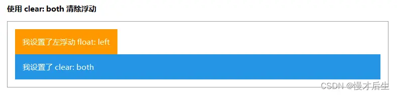
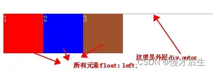
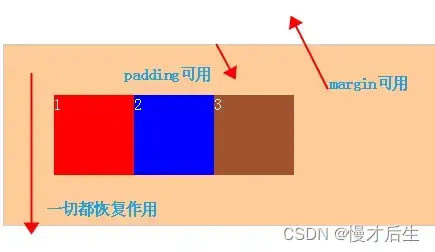

转载地址：
<a href="https://www.cnblogs.com/qin-tian/p/5910288.html">https://www.cnblogs.com/qin-tian/p/5910288.html</a>
<a href="https://my.oschina.net/leipeng/blog/221125">
https://my.oschina.net/leipeng/blog/221125</a>
<a href="https://www.cnblogs.com/leejersey/p/3991398.html">
https://www.cnblogs.com/leejersey/p/3991398.html</a>

说起清除浮动，大家肯定会想起 clear: both ，的确，这是 CSS 中清除浮动的属性，clear 有 both/left/right/none/inherit 几个属性值，分别代表在元素左右两侧不允许出现浮动元素/左侧不允许出现浮动元素/右侧不允许出现浮动元素/不清除浮动/继承父元素的值。
注意：clear属性只是在block元素是起作用，如果你把clear:both用在一个inline-block或inline元素上，clear:both是不会起任何作用的。】

**浮动的兄弟元素 如何避免 对其兄弟元素造成影响？？？**
直接为 浮动元素的 兄弟元素 设置 clear: both ；
> 
> 设置了 clear: both （当然在该例子中也可以为 clear:left）的元素不会跟浮动元素同行，也不会根据内容来自动调整宽度，而是会占据新的一整行。
> 之所以会这样，要从 clear的原理说起，clear 会为元素添加足够的空白空间，这跟增加元素外边距使到元素占据满行而强制换行的效果是一样的。
> 这只是清除了**浮动 对于兄弟元素的影响** ，而 **父元素 高度塌陷** 的问题还没有解决，因此，我们需要更高级的清除浮动的方法。

**如何解决 浮动元素的 父元素 高度塌陷 问题？？？**
在标准文档流下，父元素高度可以被子元素撑开。
当父元素不设置浮动， 未给父元素设定 固定高度 时。当子元素设置了浮动，脱离了标准的文档流，那么父元素的高度会变成 0。
如果不清除浮动造成的影响，父元素高度不够，若设置border或者background属性都将得不到正确的解析。
***解决办法***

1、给浮动元素的  “父级” 指定 固定height
2、激活浮动元素 “上一级”的BFC。给浮动元素的 “上一级” 加overflow:auto; 或overflow:hidden;
3、使用：after伪元素，相当于给浮动元素，添加 “带有clear:both的兄弟元素”。【以上两种方式都存在局限性，此法为 最优解】

```css
.clearfix:after{
   content:"";
   dispaly:block;
   clear:both;
   height:0;/* 此处使用line-height:0;也可 */
   visibility:hidden;
}
.clearfix{
   zoom:1;/* 兼容IE6 */
}
```
或是：
```css
.clearfix:after,.clearfix:before{
   content:"";
   display:table;
}
.clearfix:after{
   clear:both;
}
```

> ## 总结： 清除浮动影响的方法 可分成2类：
> 1.利用 clear 属性，包括在浮动元素末尾添加一个带有 clear: both 属性的空 div 来闭合元素，其实利用 :after伪元素的方法也是在元素末尾添加一个内容为一个点并带有 clear: both 属性的元素实现的。
> 2.触发 *浮动元素* **父元素**的 BFC (Block Formatting Contexts, 块级格式化上下文)，使到该父元素可以包含浮动元素。

一、抛一块问题砖（display： block）先看现象：


```html
<div class="outer">
    <div class="div1">1</div>
    <div class="div2">2</div>
    <div class="div3">3</div>
</div>
.outer{border: 1px solid #ccc;background: #fc9;color: #fff; margin: 50px auto;padding: 50px;}
.div1{width: 80px;height: 80px;background: red;float: left;}
.div2{width: 80px;height: 80px;background: blue;float: left;}
.div3{width: 80px;height: 80px;background: sienna;float: left;}
```
这里我没有给最外层的DIV.outer 设置高度，但是我们知道如果它里面的元素不浮动的话，那么这个外层的高是会自动被撑开的。但是当内层元素浮动后，就出现了以下影响：
（1）背景不能显示 （2）边框不能撑开 （3）margin 设置值不能正确显示

## 清除css浮动：

>方法一：为浮动子元素添加 新的兄弟元素  、应用 clear：both；
```html
<div class="outer">
    <div class="div1">1</div>
    <div class="div2">2</div>
    <div class="div3">3</div>
    <div class="clear"></div>
</div>
.clear{clear:both; height: 0; line-height: 0; font-size: 0}
result： （纠正： padding不会受影响）
```

>方法二：父级div定义 overflow: auto（注意：是父级div也就是这里的  div.outer）
```html
<div class="outer over-flow"> //这里添加了一个class
    <div class="div1">1</div>
    <div class="div2">2</div>
    <div class="div3">3</div>
    <!-- <div class="clear"></div> -->
</div>
.over-flow{
    overflow: auto; zoom: 1; //zoom: 1; 是在处理兼容性问题
}
```
原理：使用overflow属性来清除浮动有一点需要注意，overflow属性共有三个属性值：hidden,auto,visible。我们可以使用hiddent和auto值来清除浮动，但切记不能使用visible值，如果使用这个值将无法达到清除浮动效果，其他两个值都可以，其区据说在于一个对seo比较友好，另个hidden对seo不是太友好，其他区别我就说不上了，也不浪费时间。

>方法三： 据说是最高大上的方法  :after 方法：（注意：作用于浮动元素的父亲）
先说原理：这种方法清除浮动是现在网上最拉风的一种清除浮动，他就是利用:after和:before来在元素内部插入两个元素块，从面达到清除浮动的效果。其实现原理类似于clear:both方法，只是区别在于:clear在html插入一个div.clear标签，而outer利用其伪类clear:after在元素内部增加一个类似于div.clear的效果。下面来看看其具体的使用方法：

```css
.outer {zoom:1;} /* for IE6/7 Maxthon2*/
.outer:after {
	clear:both;
	content:'.';
	display:block;
	width: 0;
	height: 0;
	visibility:hidden;
}  /* for FF/chrome/opera/IE8 */
```
其中clear:both;指清除所有浮动；content: '.'; display:block;对于FF/chrome/opera/IE8不能缺少，其中content可以取值也可以为空。visibility:hidden;的作用是允许浏览器渲染它，但是不显示出来，这样才能实现清楚浮动。

注意：下一标签直接清除浮动兄弟标签浮动时，在下一标签的属性中直接写入清除clear:both;这样就可以清除以上标签的浮动而不用加入空标签来清除浮动。

结语：清除浮动的方式虽然是有很多种，但是不是每种都适合你，也不是每种都能很好的兼容所有浏览器，所以参照你觉得最好的方式去做，个人觉得方法三不错，不需多于的标签，而且也能很好的兼容。再次again：当一个内层元素是浮动的时候，如果没有关闭浮动时，其父元素也就不会再包含这个浮动的内层元素，因为此时浮动元素已经脱离了文档流。也就是为什么外层不能被撑开了！
