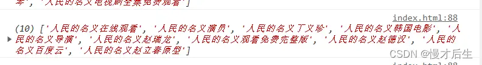

## 什么是 回调函数？
在 JavaScript 中，回调函数是指将一个函数作为参数传递给另一个函数，以在某些操作完成后通知调用者。当操作完成时，被调用的函数（即回调函数）将被调用，以执行某些指定的操作或返回一些数据。回调函数通常被用来处理异步操作，如定时器、Ajax 请求、事件处理器等。

## 什么是 JSONP ？
JSONP（JSON with Padding）是一种通过在页面中 动态创建`script标签`，以实现跨域请求数据的技术。它是一种基于 回调函数的技术，它可以绕过浏览器的同源策略，使得页面可以请求来自不同域名的数据。

在使用 JSONP 技术时，需要在页面中 动态创建一个`script标签`，并 将请求的 URL 包装在一个回调函数中。服务器在返回数据时，将数据作为回调函数的参数返回，这样浏览器就可以直接执行该函数，并将数据作为函数的参数进行处理。

JSONP 的优点是它可以绕过浏览器的同源策略，可以请求来自不同域名的数据，而不会因为跨域而受到限制。缺点是它只支持 GET 请求，并且请求的数据需要由服务器来控制和返回，因此它的灵活性和安全性相对较低。此外，由于 JSONP 依赖于回调函数，在处理复杂的请求时，可能会导致代码难以维护和调试。

## 能通过JSONP获取数据的接口 需要有什么条件？

### 1.支持 回调函数：
JSONP 的原理是通过在页面中动态创建`script标签`来请求数据，因此接口返回的数据必须以 JavaScript 函数的形式返回，这个函数名一般是通过 URL 参数传递的。

### 2.跨域请求：
由于浏览器的同源策略限制，一般情况下只能在同域名、同协议、同端口下进行 AJAX 请求。而 JSONP 利用了动态创建`script标签`不受同源策略的限制，因此可以实现跨域请求。但是，需要注意的是 JSONP 也有安全性问题，因为它依赖于服务端返回的 JavaScript 代码，因此需要确保接口的可信度。

总之，JSONP 只适用于特定的接口，而不是适用于所有请求文件。如果接口不支持回调函数或者跨域请求，那么就不能使用 JSONP 技术。

## 基础就这些，，，进入正题：
先上百度接口 https://sp0.baidu.com/5a1Fazu8AA54nxGko9WTAnF6hhy/su?wd=

wd 为搜索关键词，

cb 比较特殊，是 提前为 回调函数 定义好的 缩写，作为查询字符串的 键值。此时 直接返回自定义函数名 fn。


 若 不使用 cb 作为 回调函数的 键名，比如设定为 callBack，此时返回的是 挂载在window上的baidu对象中的sug方法。（如下），



我对script标签src请求接口，并引入js资源的理解：


通过此种方式等同于直接引入一个js模块（同cdn引入第三方库），该文件的js代码相当于直接插入到当前文件，当然可以执行其中的代码。

接口分析：目前接口中是一个 执行语句。调用了一个函数，（自定义函数fn、或者是window.baidu对象中的sug方法），给该函数 传递 了一个 对象 作为 实参。也就是说，通过src直接在当前文件中插入了 一个执行语句（携带有实参的函数）。


重点是，需要在当前文件中提前 声明 该函数 以备通过src引入执行语句后 立即执行fn、或者是window.baidu对象中的sug方法（抛出实参，或进一步加工数据）


若 script标签 还没有返回 接口提供的 js执行语句，该函数不会被执行。也就是说，在 渲染data 之前，加工数据的执行语句 会一直 等待执行。。。。

```js
//针对于cb回调：

//声明 回调函数 fn
      
function fn(data) {
    console.log(data.s);
}
```

```js
//针对于 callBack：

//声明 回调函数（与返回函数相对应，window.baidu对象的sug方法）

window.baidu = {
    sug: function (data) {
        console.log(data.s);
    }
}
```

下面是 主要代码：
```js
let searchEle = document.getElementById('search');
searchEle.addEventListener('input', function () {
    scriptFn(this.value, 'fn');
});

function scriptFn(value, callBack) {
    // append()无法将字符串解析为dom节点，使用append添加节点，不能使用将script标签放入``反义字符串中
    let scriptEle = document.createElement('script');
    scriptEle.src = 'https://sp0.baidu.com/5a1Fazu8AA54nxGko9WTAnF6hhy/su?wd=' + value + '&cb=' + callBack;
    document.body.append(scriptEle);
};

```

console.log(data.s) 打印得到的数据：


